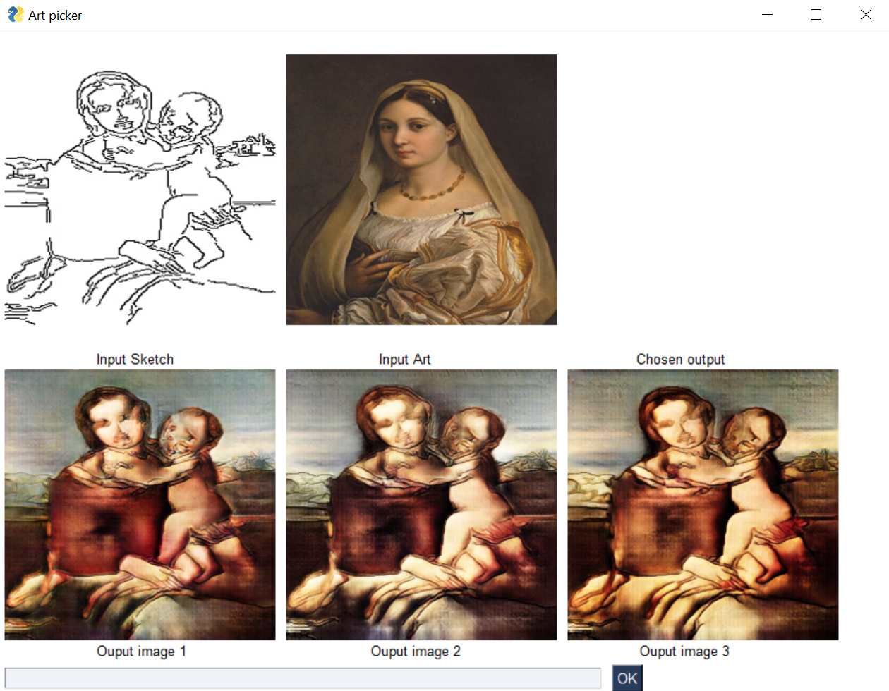

# 🤖 Zupstn Website API and Backend

API and backend for my [website](https://zupstn.com/).

This repository is split into two parts:

1) A super lightweight backend for graph data utilising Vercel

2) A lightweight version of my dissertation's code, a **"RLHF cycle app"**. This app takes input images, uses AI to generate new images, and allows users to choose between them to further refine the generated outputs. Based on these choices, the model adapts accordingly.

This second system is currently hosted on **Google Cloud**. The rest of this README is about my dissertation.

---

## Table of Contents

- [My Dissertation](#my-dissertation)
  - [Abstract](#abstract)
- [Running the RLHF Cycle App Locally](#running-the-rlhf-cycle-app-locally)
  - [Prerequisites](#prerequisites)
  - [Execution](#execution)
- [Running the API Locally](#running-the-api-locally)
  - [Prerequisites](#prerequisites-1)
  - [Execution](#execution-1)
- [References](#references)

---

## My Dissertation

My dissertation, **"Human Involvement Can Improve Current Image Synthesis Methods within the Domain of Art"**, can be found [here](https://s3-eu-north-1.amazonaws.com/zudissertationbucket/Dissertation.pdf).

It focuses on **Generative Models** and how they can be improved for artistic applications by utilizing human feedback. Below is a screenshot of the GUI packaged with my app, helping users generate images closer to what they imagined.

<p align="center">
  
</p>

### Abstract

> Image Synthesis within the domain of art remains a difficult task due to its complex and human nature. Many current models either suffer from insufficient user control or inadequate output quality. This dissertation employs Reinforcement Learning Human Feedback (RLHF) as a solution to resolve both these problems simultaneously. A "feedback loop" model is presented that overlays an existing model. This allows for the refinement of output images by a user, thus improving control. This method also allows for the collection of losses from the user’s choices to allow for further updates to the underlying network. This effectively enables the model to learn from a user. The results produced by this dissertation show a quantitative improvement in user control over baseline models. They also show the qualitative success of the RLHF implementation. However, further analysis is required to confirm whether this RLHF implementation improves output quality.

---

## Running the RLHF Cycle App Locally

This repository does not include the GUI as it is meant to be a **lightweight version**. However, the RLHF cycle app can still be run manually.

### Prerequisites

- Python 3
- `numpy`
- `torch`
- `matplotlib`
- `pillow`
- `torchvision`

### Execution

1. Place your desired **sketch** and **style images** in the `diss-img-tool-lw/imgs/` folder, renaming them appropriately.
2. In the root folder, run:

   ```sh
   python ./diss-img-tool-lw/first_image_generator.py
   ```

This runs a **single iteration** of the app, outputs can found in the saved folder, with said outputs to run another iteration, input the chosen option as the new style image.

---

## Running the API Locally

You can run this using **Docker** for a seamless experience without dependency issues. However, for local API execution, I recommend simply using **Node.js**.

### Prerequisites

#### With Docker:
- Docker

#### With Node.js:
- Node.js
- Python 3
- `numpy`
- `torch`
- `matplotlib`
- `pillow`
- `torchvision`

### Execution

1. Install dependencies:
   ```sh
   npm install
   ```

2. Start the server:
   ```sh
   npm start
   ```

Once set up, API requests can be made easily using [Postman](https://www.postman.com/).

Example API Calls:
```sh
1) POST localhost:8080/upload/sketch {body: sketchimage.png}
2) POST localhost:8080/upload/style {body: styleimage.png}
3) GET localhost:8080
4) GET localhost:8080/option/1  # Selects option 1 to run again
```

## References
Below are some of the most important references my work stands on top of, a full list can be found within my dissertation.

- Liu, B., Song, K., Zhu, Y. and Elgammal, A., 2020b. Sketch-to-art: Synthesizing stylized art images from sketches [Online]. Available from: https://arxiv.org/abs/2002.12888

- Li, Z., Yang, Z. and Wang, M., 2023. Reinforcement learning with human feedback: Learning dynamic choices via pessimism [Online]. Available from: https://arxiv.org/abs/2305.18438

- Wilber, M.J., Fang, C., Jin, H., Hertzmann, A., Collomosse, J. and Belongie, S., 2017. Bam! the behance artistic media dataset for recognition beyond photography [Online]. Available from: https://arxiv.org/abs/1704.08614


- Zhu, J.Y., Zhang, R., Pathak, D., Darrell, T., Efros, A.A., Wang, O. and Shechtman, E., 2017c. Toward multimodal image-to-image translation [Online]. Available from: https://github.com/junyanz/BicycleGAN